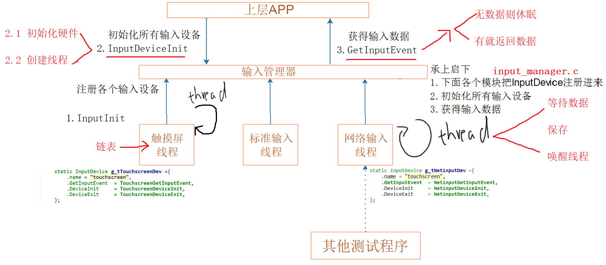
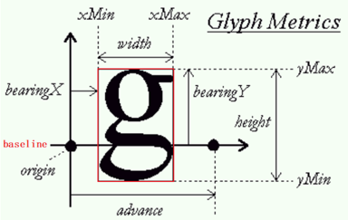
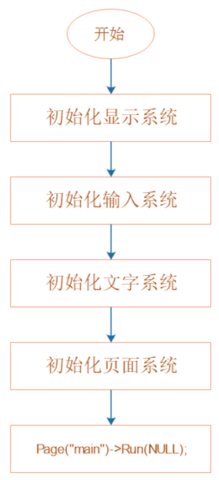
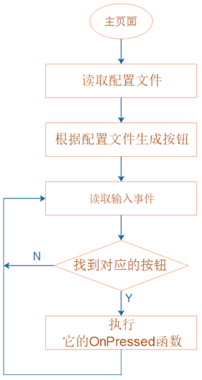
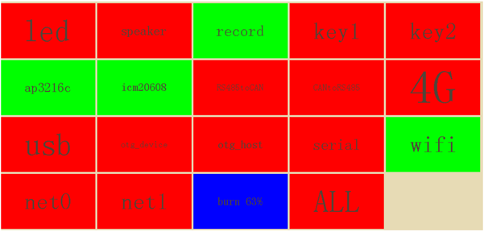
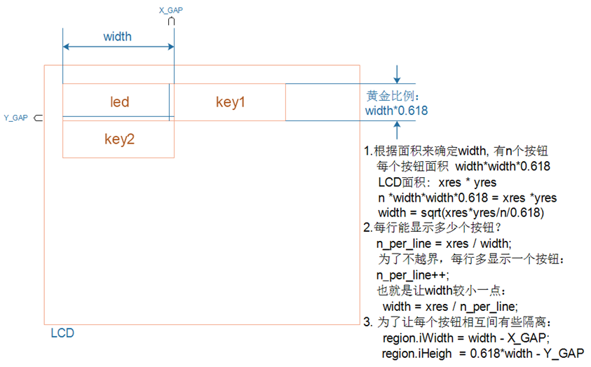

# 电子产品量产工具

## 一、程序框架


## 二、显示系统

### 1. Framebuffer 编程

数据结构抽象：

```c
typedef struct Region{

	int iLeftUpX;
	int iLeftUpY;
	int iWidth;
	int iHeigh;
}Region, *PRegion;

typedef struct Dispopr {
	char *name;
	char *GetBuffer(int *pXres, int *pYres, int *pBpp);
    int FlushRegion(PRegion ptRegion,char *buffer);
    struct Dispopr *ptNext;
}DispOpr, *PDispOpr;
```


### 2. 显示管理


* 测试


## 三、输入系统

1\. 上报的数据格式

```c
#define INPUT_TYPE_TOUCH 1
#define INPUT_TYPE_NET   2
typedef struct InputEvent {

    struct timeval tTime;
	int iType;
	int iX;
    int iY;
	int ipressure;
    char str[1024];
}InputEvent， *PInputEvent;
```


2\. 模块化结构体

```c
typedef struct InputDevice {

    char*name;
	int (*GetInputEvent)(PInputEvent ptInputEvent);
    int (*DeviceInit)(void);
	int (*DeviceExit)(void);
    struct InputDevice *ptNext;
}InputDevice, *PInputDevice;
```


### 1. 触摸屏编程

实现如下结构体：使用tslib

```c
static InputDevice g_tTouchscreeOpr = {

	.name          = "touchscreen",
	.GetInputEvent = TouchscreenGetInputEvent,
	.DeviceInit    = TouchscreenDeviceInit,
	.DeviceExit    = TouchscreenDeviceExit,
};
```

测试，编写一个main函数，直接使用该结构体


### 2. 网络输入编程

实现如下结构体：

```c
static InputDevice g_tNetinputOpr = {

	.name          = "netinput",
	.GetInputEvent = NetinputGetInputEvent,
	.DeviceInit    = NetinputDeviceInit,
	.DeviceExit    = NetinputDeviceExit,
};
```

测试，编写一个main函数，直接使用该结构体


### 3. 输入管理

* 输入管理器：只需要对外提供3个函数：InputInit、InputDeviceInit、GetInputEvent



* **怎么避免数据丢失？**

  2\. 核心在于：GetInputEvent
  2.1 怎么同时读取多个设备？
  　　读取触摸屏时，可能会休眠，那么网络输入就会丢失；
  　　读取网络数据时，可能会休眠，那么触摸屏数据就会丢失
  2.2 所以不能使用“先后轮询的方式”，不能使用下面的代码:
  
  ```c
  while (1)
  {
      g_tTouchscreenDev.GetInputEvent(&event1);
      g_tInputDev.GetInputEvent(&event2);
  }
  ```

  2.3 要想支持多个输入设备，只能使用线程：
  　　为每个 InputDevice 都创建一个“读取线程” 
  3\. 比如触摸屏，它会一下子上报很多数据
    　对于网络输入，也有可能同时有多个 client 发来数据
  3.1 所以，不能使用单一的变量来保存数据，而是使用一个数组来保存数据
  3.2 使用“环形缓冲区”

* **输入管理单元测试**

  编写main函数，调用这3个函数即可:InputInit、InputDeviceInit、GetInputEvent


## 四、文字系统

> 使用点阵绘制文字时：每个文字的大小一样，前后文件互不影响
>
> 使用 Freetype 绘制文字时：大小可能不同，前面文字会影响后面文字

### 1. 实现 Freetype 代码

1\. 对于单个 Freetype 字符，格式如下：



2\. 我们要抽象出一个结构体 FontBitMap，能描述一个“字符”：位置、大小、位图

```c
typedef struct FontBitMap {
	
    int iXLeft;                  /* 位图左上角 × 座标 */
    int iYTop;                   /* 位图左上角 Y 座标 */
    int iXMax;                   /* 位图的最大 X 座标值 */
    int iYMax;                   /* 位图的最大Y座标值 */
	int iBpp;                    /* 位图中一个象素用多少位来表示 */
	int iPitch;         /* 对于单色位图，两行象素之间的跨度，即第N行，第 N+1 行象素数据之间的偏移值 */
    int iCuroriginx;             /* 位图的原点 x 座标(一般是左下角)，使用原点来确定相邻字符的位置 */
	int iCurOriginY;             /* 位图的原点Y座标 */
	int iNextOriginx;            /* 下一个字符即右边字符的原点 x 座标 */
    int iNextOriginY;            /* 下一个字符即右边字符的原点 Y 座标 */
    unsigned char *pucBuffer;    /* 存有字符的位图数据 */
}FontBitMap, *PFontBitMap;
```


3\. 我们还要抽象出一个结构体 FontOpr，能描述字体的操作，比如 Freetype 的操作、固定点阵字体的操作

```c
typedef struct Fontopr {
	
    char *name ;/*字体模块的名字*/
	int (*Fontinit)(char *pcFontFile, unsigned int dwFontSize);    /* 字体模块的初始化函数 */
	int (*GetFontBitmap)(unsigned int dwCode, PT_FontBitMap ptFontBitMap);
                                                                /* 根据编码值获得字符的位图 */
    void (*SctFontSize)(unsigned int dwFontsize);               /* 设置字体尺寸(单位:象素) */
	struct FontOpr *ptNext;    /* 链表 */
}T_Fontopr, *PT_Fontopr;
```


### 2. 输入管理

1\. 参照下图实现 font_manager.c，向上层提供更简单的接口函数：


2\. 在 LCD 上显示出来，在 disp_manager.c 中还要实现一个绘制函数：DrawFontBitMap


## 五、UI 系统

> 所谓UI，就是 User Interface (用户界面)，有图像界面(GUI)等

数据结构抽象：

```c
typedef struct Button {

    char *name;
	Region tRegion;
	int (*OnDraw)(struct Button *ptButton, PDispBuff ptDispBuff);
	int (*onPressed)(struct Button*ptButton, PDispBuff ptDispBuff, PInputEvent                                ptInputEvent);
}Button，*PButton;
```

### 1. 编写按钮的代码

1\. 点击按钮后怎么处理，是业务系统的事情
2\. 所以应该提供一个 InitButton 函数，让用户可以提供 OnPressed 函数
3\. 上层代码通过下面3个函数使用按钮


* 测试

  1\. 调用InitButton初始化按钮

  2\. 调用OnDraw函数显示按钮

  3\. 周期性的调用OnPressed函数改变按钮的颜色


## 六、页面系统


* 页面管理器
  
  对于每一个页面，抽象出如下结构体，核心在于其中的 Run 函数：
  
  ```c
  typedef struct PageAction {
      
  	char *name;
  	void(*Run)(void *pParams);
      struct PageAction *ptNext;
  }PageAction, *PPageAction;
  ```
  
  页面管理器用来管理页面，只需要实现2个函数：
  
  1\. PagesRegister: 把多个页面注册进链表
  2\. Page(name)：取出某个页面
  
  


* 测试

  1\. 创建一个 PageAction g_tMainPage：
  
  ```c
  static void MainPageRun(void *pParams){
      
  	printf("%s %s %d\n", __FILE__, __FUNCTION__, __LINE__);
  }
  
  static PageAction g_tMainPage = {
      
  	.name = "main",
  	.Run = MainPageRun,
  };
  
  void MainPageRegister(void){
  
      PageRegister(&g_tMainPage);
  }
  ```
  
  2\. 调用
  
  ```c
  int main(int argc, char **argv){
      
  	PagesRegister() ;
  	Page( "main" )->Run(NULL);
      return 0;
  }
  ```


## 七、业务系统

> 1\. 前面实现了各个子系统：显示、输入、文字、UI、页面
> 2\. 它们只是提供基础能力，跟业务逻辑没有关系
> 3\. 这样的架构很容易扩展，可以在这上面实现各种业务
> 4\. 比如可以做收银机、自动售卖机、智能称、取号机；再加上摄像头显示，就可以做出可视对讲、视频监控、人脸红外测温
>  5\. 对于不同的产品，我们只需要写出自己页面函数

### 1. 流程


* **业务系统：程序流程图**

  

* **业务系统：主页面流程图**

  


### 2. 处理配置文件

1\. 想要显示这样的界面




2\. 有哪些按钮？按钮的名字是什么？能否在触摸屏上点击这个按钮？这些信息，来自配置文件 `/etc/test_gui/gui.conf`

```tex
#号表示注释,
  名字       能否被点击    状态发生变化时可以调用某个命令
# name    can_be_touch    command
led           1            led.sh
speaker       1
record        0
key1          0
key2          0
ALL           0            test_sleep_key.sh
```


3\. 对于配置文件的每一行，都创建一个 ItemCfg 结构体，并对外提供函数，比如获得某个配置项

```c
typedef struct ItemCfg {

	int index;
	char name[100];
	int bCanBeTouched;
	char command[100];

}ItemCfg, *PItemCfg; 
```


### 3. 生成界面

**怎么确定每个按钮的位置、大小？需要计算！**

**计算每个按钮的 Region：**




### 4. 处理输入事件

1\. 我们得到的输入事件，可能来自触摸屏，也可能是其他 APP 发来的网络数据

**<font color='red'>根据结构体 struct InputEvent 的 iType 这项分辨输入事件的类型</font>**

2\. 对于触摸屏事件，根据 iX、iY 找到按钮

3\. 对于网络数据，我们限定为这样的格式：“name ok”、“name err”、“name 70%”，根据name找到按钮

4\. 对于按钮，我们要提供自己的 OnPressed 函数，不适用 UI 系统默认的函数


## 八、优化

### 1. 按钮文字

按钮文字大小不一，没有严格居中，太小看不清；根据配置文件的各项确定最长的名字，确定字符大小：每个按钮中文字大小都一样；修改 `disp_manager.c` 中的 `DrawTextInRegionCentral`


### 2. 接口函数名优化

显示系统、输入系统中，有多个init函数，让人难以分辨。如下修改：如：`DisplayInit();` 改成 `DisplaySystemRegister()`，`InputInit();` 改成 `InputSystemRegister()`，


### 3. 支持配置文件中的 command

main_page.c：
在按钮的 OnPressed 函数中，用 system 函数运行 command：

```c
/* 执行command */
ptItemCfg = GetItemCfgByName(ptButton->name);
if(ptItemCfg->command[0] != '\0'){

    sprintf(command, "%s %s", ptItemCfg->command, command_status[command_status_index]);
	system(command);
}
```

